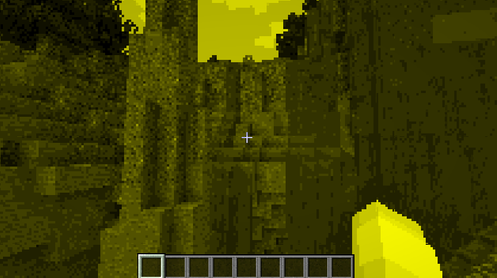
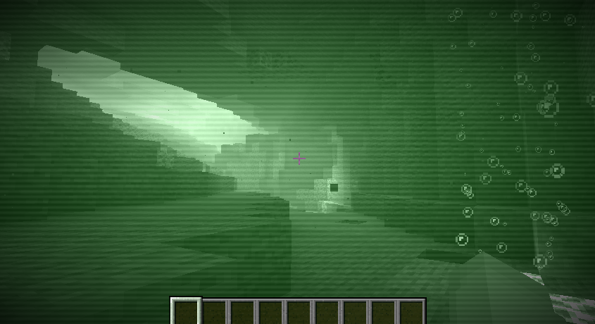

# VisualJS

VisualJS is a mod that allows you to add effects to the game via shaders (So it's highly recommended for you to read about [GLSL](https://learnopengl.com/Getting-started/Shaders)). The mod adds the effects via the vanilla's post-effect system, so it's compatible with other mods like, at least `Embeddium`.

You can start by simply adding effects that exist in the game, like this, but note that all scripts must be executed in the client side:

```js
let applied = false

ClientEvents.tick(event => {
    if (!applied) {
        applied = true
        // Apply the effect, calling only once is ok.
        VisualJS.applyEffect("creeper", true)
    }

    let { level, player } = event

    // Modify uniform values
    VisualJS.setUniform(0, "RedMatrix", [0.3, 0.59, 0.11])
})

ClientEvents.loggedOut(event => {
    applied = false
})
```

`creeper` is an post-effect located in `minecraft/shaders/post/creeper.json`, the `true` indicates that VisualJS will prevent the effect from being changed/removed by vanilla code. You can also add your own effects and shader programs, as long as they follow a same file structure as the vanilla ones, because Minecraft will only load the effects and shaders there.

You might notice that the uniforms can be modified programatically. So, this mean that your effects can receive values from your JS scripts, and have a more dynamic behavior. With the uniform modified, you can see something like this in game:



Of course you can also add many other cool features, and I've got one done as the example, you can refer to the [example](./examples/crt_example/) for more details, if everything is done correctly, you should see something like this, and the shader will also change if you move closer or further from a light source:

